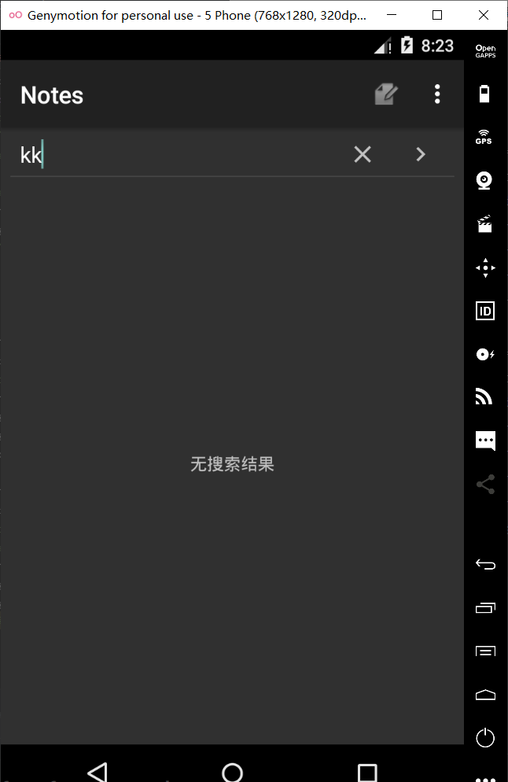

# **Notepad plus**


## **添加时间戳**

数据库中已有文本创建时间和修改时间两个字段，修改NoteEditor.java编辑updateNote（）函数，选取修改时间字段，并将其格式化存入数据库

```
Long now = Long.valueOf(System.currentTimeMillis());//获取当前时间
SimpleDateFormat sf = new SimpleDateFormat("yy/MM/dd HH:mm");//设置时间类型
Date d = new Date(now);//时间转换为Date类型
String format = sf.format(d);//将时间变成我们需要的sf格式
values.put(NotePad.Notes.COLUMN_NAME_MODIFICATION_DATE, format);//将时间存入数据库
```

编辑NoteList.java中PROJECTION的内容，添加对该字段的描述，这样后面搜索中才能从SQLite中读取修改时间的字段

```
 private static final String[] PROJECTION = new String[] {
            NotePad.Notes._ID, // 0
            NotePad.Notes.COLUMN_NAME_TITLE, // 1
            NotePad.Notes.COLUMN_NAME_MODIFICATION_DATE
    };
```

修改适配器内容，增加dataColumns中装配到ListView的内容，所以要同时增加一个文本框来存放时间

```
final String[] dataColumns = { NotePad.Notes.COLUMN_NAME_TITLE , NotePad.Notes.COLUMN_NAME_MODIFICATION_DATE} ;//新增时间戳内容
int[] viewIDs = { android.R.id.text1 ,R.id.text2};//增加文本框存放时间
```

修改notelist_item里面的内容，增加一个textview组件

```
<LinearLayout xmlns:android="http://schemas.android.com/apk/res/android"
    android:layout_width="match_parent"
    android:layout_height="match_parent"
    android:orientation="vertical"
    android:paddingLeft="6dip"
    android:paddingRight="6dip"
    android:paddingBottom="3dip">

    <TextView
        android:id="@android:id/text1"
        android:layout_width="match_parent"
        android:layout_height="?android:attr/listPreferredItemHeight"
        android:textAppearance="?android:attr/textAppearanceLarge"
        android:gravity="center_vertical"
        android:paddingLeft="5dip"
        android:singleLine="true"
        />
    <TextView
        android:id="@+id/text2"
        android:layout_width="match_parent"
        android:layout_height="wrap_content"
        android:textAppearance="?android:attr/textAppearanceLarge"
        android:gravity="center_vertical"
        android:singleLine="true"
        />
</LinearLayout>
```

测试实验结果


添加时间戳成功！

## **搜索功能**

修改NoteList.java中onCreate()函数的加载布局文件

```
 setContentView(R.layout.searchview);//加载搜索框布局
```

设置searchview监听器，首先找到search组件，创造searchView得响应时间，根据传入得s进行搜索，然后写下selection语句NotePad.Notes.COLUMN_NAME_TITLE + " GLOB ‘" + s + "’"，运用getContentResolver().query对SQLite里面得数据进行搜索，PROJECTION则是在设置时间戳得时候已经书写好，如果s为空，则是把所有信息显示出来

```
public void SearchView(final SimpleCursorAdapter adapter) {
        SearchView searchView = findViewById(R.id.search2);//找到search组件
        searchView.setSubmitButtonEnabled(true);
        searchView.setOnQueryTextListener(new SearchView.OnQueryTextListener() {
            @Override
            public boolean onQueryTextSubmit(String query) {
                return false;
            }

            @Override
            public boolean onQueryTextChange(String s) {
                Cursor newCursor;

                if (!s.equals("")) {
                    String selection = NotePad.Notes.COLUMN_NAME_TITLE + " GLOB '*" + s + "*'";
                    newCursor = getContentResolver().query(
                            getIntent().getData(), //获取数据
                            PROJECTION, //返回笔记ID和标题
                            selection,
                            null,
                            NotePad.Notes.DEFAULT_SORT_ORDER //使用默认排序
                    );
                } else {
                    newCursor = getContentResolver().query(
                            getIntent().getData(),
                            PROJECTION,	
                            null,
                            null,
                            NotePad.Notes.DEFAULT_SORT_ORDER
                    );
                }
                adapter.swapCursor(newCursor); // 视图将同步更新！
                return true;
            }
        });
    }
```

在onCreate()中调用searchview()

```
SearchView(adapter);
```

新建一个searchview的布局文件，设置一个搜索布局文件，由searchview，textview，listview组件组成

```
<LinearLayout xmlns:android="http://schemas.android.com/apk/res/android"
    android:layout_width="match_parent"
    android:layout_height="match_parent"
    android:orientation="vertical">
    <SearchView
        android:id="@+id/search2"
        android:layout_width="match_parent"
        android:layout_height="wrap_content"
        android:queryHint="请输入搜索内容"
        >
    </SearchView>

    <ListView
        android:paddingLeft="10dp"
        android:paddingRight="10dp"
        android:id="@android:id/list"
        android:layout_width="match_parent"
        android:layout_height="0dp"
        android:layout_weight="1"
        android:drawSelectorOnTop="false" />
    <TextView
        android:paddingLeft="10dp"
        android:paddingRight="10dp"
        android:id="@android:id/empty"
        android:gravity="center"
        android:layout_width="match_parent"
        android:layout_height="0dp"
        android:layout_weight="1"
        android:text="无搜索结果" />
</LinearLayout>
```

测试实验结果




搜索成功！