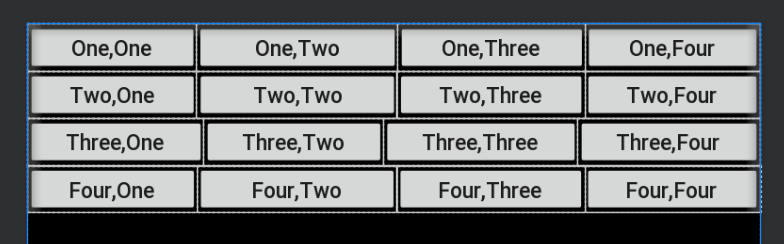

# **实验二 android布局**

## **线性布局**

***linear_layout.xml***

```
<?xml version="1.0" encoding="utf-8"?>
<LinearLayout xmlns:android="http://schemas.android.com/apk/res/android"
    android:layout_width="match_parent"
    android:layout_height="match_parent"
    android:background="@color/colorBlack"
    android:orientation="vertical">

    <LinearLayout
        android:layout_width="match_parent"
        android:layout_height="wrap_content">

        <Button
            android:layout_width="wrap_content"
            android:layout_height="wrap_content"
            android:layout_weight="0.9" 
            android:textSize="25sp" 
            android:text="@string/button11"
            android:textAllCaps="false" /> 

        <Button
            android:layout_width="wrap_content"
            android:layout_height="wrap_content"
            android:layout_weight="1.3"
            android:textSize="25sp"
            android:text="@string/button12"
            android:textAllCaps="false" />

        <Button
            android:layout_width="wrap_content"
            android:layout_height="wrap_content"
            android:layout_weight="0.9"
            android:textSize="25sp"
            android:text="@string/button13"
            android:textAllCaps="false" />

        <Button
            android:layout_width="wrap_content"
            android:layout_height="wrap_content"
            android:layout_weight="0.9"
            android:textSize="25sp"
            android:text="@string/button14"
            android:textAllCaps="false" />
    </LinearLayout>

    <LinearLayout
        android:layout_width="match_parent"
        android:layout_height="wrap_content">

        <Button
            android:layout_width="wrap_content"
            android:layout_height="wrap_content"
            android:layout_weight="0.9"
            android:textSize="25sp"
            android:text="@string/button21"
            android:textAllCaps="false" />

        <Button
            android:layout_width="wrap_content"
            android:layout_height="wrap_content"
            android:layout_weight="1.3"
            android:textSize="25sp"
            android:text="@string/button22"
            android:textAllCaps="false" />

        <Button
            android:layout_width="wrap_content"
            android:layout_height="wrap_content"
            android:layout_weight="0.9"
            android:textSize="25sp"
            android:text="@string/button23"
            android:textAllCaps="false" />

        <Button
            android:layout_width="wrap_content"
            android:layout_height="wrap_content"
            android:layout_weight="0.9"
            android:textSize="25sp"
            android:text="@string/button24"
            android:textAllCaps="false" />
    </LinearLayout>

    <LinearLayout
        android:layout_width="match_parent"
        android:layout_height="wrap_content">

        <Button
            android:layout_width="wrap_content"
            android:layout_height="wrap_content"
            android:layout_weight="1"
            android:textSize="25sp"
            android:text="@string/button31"
            android:textAllCaps="false" />

        <Button
            android:layout_width="wrap_content"
            android:layout_height="wrap_content"
            android:layout_weight="1"
            android:textSize="25sp"
            android:text="@string/button32"
            android:textAllCaps="false" />

        <Button
            android:layout_width="wrap_content"
            android:layout_height="wrap_content"
            android:layout_weight="1"
            android:textSize="25sp"
            android:text="@string/button33"
            android:textAllCaps="false" />

        <Button
            android:layout_width="wrap_content"
            android:layout_height="wrap_content"
            android:layout_weight="1"
            android:textSize="25sp"
            android:text="@string/button34"
            android:textAllCaps="false" />
    </LinearLayout>

    <LinearLayout
        android:layout_width="match_parent"
        android:layout_height="wrap_content">

        <Button
            android:layout_width="wrap_content"
            android:layout_height="wrap_content"
            android:layout_weight="0.9"
            android:textSize="25sp"
            android:text="@string/button41"
            android:textAllCaps="false" />

        <Button
            android:layout_width="wrap_content"
            android:layout_height="match_parent"
            android:layout_weight="1.3"
            android:textSize="25sp"
            android:text="@string/button42"
            android:textAllCaps="false" />

        <Button
            android:layout_width="wrap_content"
            android:layout_height="wrap_content"
            android:layout_weight="0.9"
            android:textSize="25sp"
            android:text="@string/button43"
            android:textAllCaps="false" />

        <Button
            android:layout_width="wrap_content"
            android:layout_height="wrap_content"
            android:layout_weight="0.9"
            android:textSize="25sp"
            android:text="@string/button44"
            android:textAllCaps="false" />
    </LinearLayout>
</LinearLayout>
```

***colors.xml***

```
<?xml version="1.0" encoding="utf-8"?>
<resources>
    <color name="colorBlack">#000000</color>
</resources>
```

***strings.xml***

```
<resources>
    <string name="button11" >One,One</string>
    <string name="button12" >One,Two</string>
    <string name="button13" >One,Three</string>
    <string name="button14" >One,Four</string>
    <string name="button21" >Two,One</string>
    <string name="button22" >Two,Two</string>
    <string name="button23" >Two,Three</string>
    <string name="button24" >Two,Four</string>
    <string name="button31" >Three,One</string>
    <string name="button32" >Three,Two</string>
    <string name="button33" >Three,Three</string>
    <string name="button34" >Three,Four</string>
    <string name="button41" >Four,One</string>
    <string name="button42" >Four,Two</string>
    <string name="button43" >Four,Three</string>
    <string name="button44" >Four,Four</string>
</resources>
```

**效果图如下：**



------

## **约束布局**

***constraint_layout.xml***

```
<?xml version="1.0" encoding="utf-8"?>
<androidx.constraintlayout.widget.ConstraintLayout xmlns:android="http://schemas.android.com/apk/res/android"
    xmlns:app="http://schemas.android.com/apk/res-auto"
    android:background="@color/colorBlack"
    android:layout_width="match_parent"
    android:layout_height="match_parent">
    <TextView
        android:id="@+id/textView1"
        android:layout_width="150dp"
        android:layout_height="150dp"
        android:background="@color/colorRed"
        android:gravity="center"
        android:text="@string/red"
        android:textColor="@color/colorBlack"
        app:layout_constraintStart_toStartOf="parent"
        app:layout_constraintTop_toTopOf="parent" />

    <TextView
        android:id="@+id/textView2"
        android:layout_width="150dp"
        android:layout_height="150dp"
        android:background="@color/colorOrange"
        android:gravity="center"
        android:text="@string/orange"
        android:textColor="@color/colorBlack"
        app:layout_constraintEnd_toEndOf="parent"
        app:layout_constraintStart_toStartOf="parent"
        app:layout_constraintTop_toTopOf="parent" />

    <TextView
        android:id="@+id/textView3"
        android:layout_width="150dp"
        android:layout_height="150dp"
        android:background="@color/colorYellow"
        android:gravity="center"
        android:text="@string/yellow"
        android:textColor="@color/colorBlack"
        app:layout_constraintEnd_toEndOf="parent"
        app:layout_constraintTop_toTopOf="parent" />

    <TextView
        android:layout_width="150dp"
        android:layout_height="150dp"
        android:id="@+id/textView4"
        android:text="@string/blue"
        android:textColor="@color/colorBlack"
        android:gravity="center"
        android:background="@color/colorBlue"
        app:layout_constraintTop_toTopOf="parent"
        app:layout_constraintEnd_toEndOf="parent"
        app:layout_constraintStart_toStartOf="parent"
        app:layout_constraintBottom_toBottomOf="parent"/>

    <TextView
        android:layout_width="150dp"
        android:layout_height="150dp"
        android:id="@+id/textView5"
        android:text="@string/green"
        android:textColor="@color/colorBlack"
        android:gravity="center"
        android:background="@color/colorGreen"
        app:layout_constraintTop_toTopOf="parent"
        app:layout_constraintEnd_toStartOf="@id/textView4"
        android:layout_marginEnd="20dp"
        android:layout_marginStart="20dp"
        app:layout_constraintBottom_toBottomOf="parent"/>

    <TextView
        android:layout_width="150dp"
        android:layout_height="150dp"
        android:id="@+id/textView6"
        android:text="@string/indigo"
        android:textColor="@color/colorBlack"
        android:gravity="center"
        android:background="@color/colorIndigo"
        app:layout_constraintTop_toTopOf="parent"
        app:layout_constraintStart_toEndOf="@id/textView4"
        android:layout_marginEnd="20dp"
        android:layout_marginStart="20dp"
        app:layout_constraintBottom_toBottomOf="parent"/>

    <TextView
        android:layout_width="match_parent"
        android:layout_height="150dp"
        android:text="@string/violet"
        android:textColor="@color/colorBlack"
        android:background="@color/colorViolet"
        android:gravity="center"
        app:layout_constraintBottom_toBottomOf="parent"/>
</androidx.constraintlayout.widget.ConstraintLayout>
```

***colors.xml***

```
<?xml version="1.0" encoding="utf-8"?>
<resources>

    <color name="colorBlack">#000000</color>
    <color name="colorRed">#FF0000</color>
    <color name="colorOrange">#FFA600</color>
    <color name="colorYellow">#FFFF00</color>
    <color name="colorGreen">#00FF00</color>
    <color name="colorBlue">#0000FF</color>
    <color name="colorIndigo">#4A0084</color>
    <color name="colorViolet">#EF82EF</color>

</resources>
```

***strings.xml***

```
<resources>

    <string name="red">Red</string>
    <string name="orange">ORANGE</string>
    <string name="yellow">YELLOW</string>
    <string name="blue">BLUE</string>
    <string name="green">GREEN</string>
    <string name="indigo">INDIGO</string>
    <string name="violet">VIOLET</string>

</resources>
```

**效果图如下：**


------

## **表格布局**

***table_layout.xml***

```
<?xml version="1.0" encoding="utf-8"?>
<TableLayout xmlns:android="http://schemas.android.com/apk/res/android"
    xmlns:tools="http://schemas.android.com/tools"
    android:layout_width="match_parent" android:layout_height="match_parent"
    android:background="@android:color/background_dark"
    android:shrinkColumns="0"
    >
    <TableRow>
        <TextView
            android:text="@string/blank"
            android:textColor="@color/colorGray" />
        <TextView
            android:gravity="left"
            android:layout_weight="1"
            android:text="@string/open"
            android:textColor="@color/colorGray" />
        <TextView
            android:gravity="right"
            android:layout_weight="1"
            android:text="@string/ctrl_o"
            android:textColor="@color/colorGray" />
    </TableRow>
    <TableRow>
        <TextView
            android:text="@string/blank"
            android:textColor="@color/colorGray" />
        <TextView
            android:gravity="left"
            android:layout_weight="1"
            android:text="@string/save"
            android:textColor="@color/colorGray" />

        <TextView
            android:layout_weight="1"
            android:gravity="right"
            android:text="@string/ctrl_s"
            android:textColor="@color/colorGray"
            tools:ignore="DuplicateIds" />
    </TableRow>
    <TableRow>
        <TextView
            android:text="@string/blank"
            android:textColor="@color/colorGray" />
        <TextView
            android:gravity="left"
            android:layout_weight="1"
            android:text="@string/save_as"
            android:textColor="@color/colorGray" />

        <TextView
            android:layout_weight="1"
            android:gravity="right"
            android:text="@string/ctrl_shift_s"
            android:textColor="@color/colorGray"
            />
    </TableRow>

    <View android:id="@+id/line"
        android:layout_width="match_parent"
        android:layout_height="1dp"
        android:background="@color/colorGray"
        />

    <TableRow>
        <TextView
            android:text="@string/x"
            android:textColor="@color/colorGray" />
        <TextView
            android:layout_weight="1"
            android:text="@string/imports"
            android:textColor="@color/colorGray" />
    </TableRow>
    <TableRow>
        <TextView
            android:text="@string/x"
            android:textColor="@color/colorGray" />
        <TextView
            android:layout_weight="1"
            android:text="@string/emport"
            android:textColor="@color/colorGray" />

        <TextView
            android:layout_weight="1"
            android:gravity="right"
            android:text="@string/ctrl_e"
            android:textColor="@color/colorGray"
            />
    </TableRow>
    <View android:id="@id/line"
        android:layout_width="match_parent"
        android:layout_height="1dp"
        android:background="@color/colorGray"
        />

    <TableRow>
        <TextView
            android:text="@string/blank"
            android:textColor="@color/colorGray" />
        <TextView
            android:layout_weight="1"
            android:text="@string/quit"
            android:textColor="@color/colorGray" />
    </TableRow>
</TableLayout>
```

***colors.xml***

```
<?xml version="1.0" encoding="utf-8"?>
<resources>

    <color name="colorGray">#CBCBCB</color>

</resources>
```

***strings.xml***

```
<resources>
    <string name="ctrl_o">Ctrl - O</string>
    <string name="blank">"    "</string>
    <string name="open">Opening</string>
    <string name="save">Save...</string>
    <string name="ctrl_s">Ctrl - S</string>
    <string name="save_as">Save as...</string>
    <string name="ctrl_shift_s">Ctrl - Shift - S</string>
    <string name="x">× </string>
    <string name="imports" >Import</string>
    <string name="emport">Emport...</string>
    <string name="ctrl_e">Ctrl- E</string>
    <string name="quit">Quit</string>
</resources>
```

**效果图如下：**

